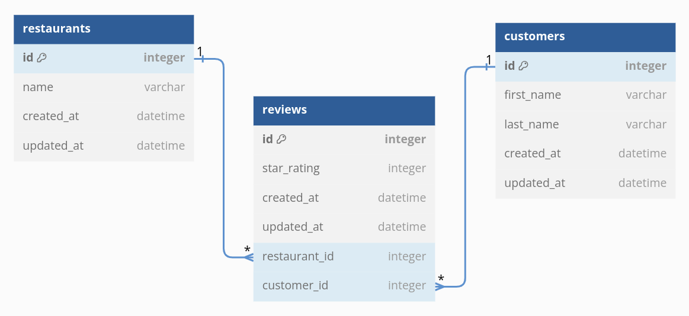

# Restaurant Review System with SQLAlchemy

## Phase 3 Week 3 Code Challenge

[](./LICENSE)


***

## Introduction

This is a Restaurant Review System built with Python and utilizes `SQLAlchemy and Alembic Migrations`, `SQLAlchemy Relationships`, `Class and Instance Methods`, and `SQLAlchemy Querying` working with a Yelp-style domain with three models: `Restaurant`, `Review`, and `Customer`.

***NOTE:** Some methods in the deliverables have been changed so they don't conflict with table names.*

***

## Table of Contents

- [Prerequisites](#prerequisites)
- [Features](#features)
- [Project Setup](#project-setup)
- [Entity Relationship Diagram](#entity-relationship-diagram)
- [Usage](#usage)
  - [Methods](#methods)
    - [Restaurant](#restaurant)
    - [Usage](#customer)
    - [Review](#review)
- [Author & License](#author--license)

***

## Prerequisites

The packages are included in the `Pipfile`, and can be installed through it into the virtual environment.

- Python3 v3.10 +

- SQLAlchemy v2.0.20

- Alembic v1.12.0

- Faker v19.3.1

***

## Features

- Create and manage customer and restaurant profiles
- Add, retrieve, and delete reviews for restaurants
- Find customers and restaurants based on reviews
- Retrieve a list of all reviews
- Find the fanciest restaurant in the list
- Find a customer's favorite restaurant

***

## Project Setup

### 1. Clone the repository

```python
git clone https://github.com/leon-kxng/sqlalchemy_restaurants
```

### 2. Navigate to the project's directory

```python
cd sqlalchemy_restaurants
```

### 3. Install required dependencies

The root directory of this repository contains the `Pipfile` with all the required dependencies. To install them into your virtual environment, run this command from the `root` directory:

```python
pipenv install
```

If `pipenv` is not already installed, you can do so using `pip`:

```python
pip install pipenv
```

### 4. Activate the virtual environment

```python
pipenv shell
```

### 5. Navigate into the `app` directory

Run all commands from within this directory

```python
cd app
```

### 5. Run `main.py` for testing

```python
./main.py
```

***

## Entity Relationship Diagram

The Restaurant Review System uses the `Association Object Models` for the associations and relationships between the three models: `Restaurant`, `Customer`, and `Reviews`.

A `Restaurant` has many `Review`s, a `Customer` has many `Review`s, and a `Review` belongs to a `Restaurant` and to a `Customer`. The ERD below shows these relationships:



***

## Usage

You can use the Restaurant Review System to simulate interactions between customers, restaurants, and reviews to:

1. Create customer and restaurant instances.
2. Add reviews using the add_review method.
3. Retrieve information about customers, restaurants, and reviews using the provided methods.

For example, you should be able to call *`session.query(Customer).first().all_restaurants()`* and see a list of the restaurants for the first customer in the database based on your seed data; and *`session.query(Review).first().customer`* should return the customer for the first review in the database.

### Methods

Use the `seed.py` file to create sample data to test the models and relationships by the following methods.

#### Restaurant

***

`self.all_reviews()`

- *changed from `self.reviews()` in deliverables*

- returns a collection of all the reviews for the `Restaurant`

`self.all_customers()`

- *changed from `self.customers()` in deliverables.*

- returns a collection of all the customers who reviewed the `Restaurant`

`cls.fanciest()`

- A **class** method that returns ***one*** restaurant instance for the restaurant that has the highest   price

`self.all_reviews_formatted()`

- returns a list of strings with all the reviews for this restaurant in the following format:

```python
[ "Review for {insert restaurant name} by {insert customer's full name}: {insert review star_rating} stars.",

"Review for {insert restaurant name} by {insert customer's full name}: {insert review star_rating} stars.", ]
```

#### Customer

***

`self.all_reviews()`

- *changed from `self.reviews()` in deliverables.*

- returns a collection of all the reviews that the `Customer` has left

`self.all_restaurants()`

*changed from `self.restaurants()` in deliverables.*

- returns a collection of all the restaurants that the `Customer` has reviewed

`self.full_name()`

- returns the full name of the customer, with the first name and the last name  concatenated, Western style.

`self.favorite_restaurant()`

- returns the restaurant instance that has the highest star rating from this customer

`self.add_review(restaurant, rating)`

- takes a `restaurant` (an instance of the `Restaurant` class) and a rating

- creates a new review for the restaurant with the given `restaurant_id`

`self.delete_reviews(restaurant)`

- takes a `restaurant` (an instance of the `Restaurant` class) and

- removes **all** their reviews for this restaurant

#### Review

***

`review.customer()`

- returns the `Customer` instance for this review

`review.restaurant()`

- returns the `Restaurant` instance for this review

`review.full_review()`

- returns a string in the following format:

```text
Review for {insert restaurant name} by {customer full_name}: {review star_rating} stars.
```

***

## Author & License

Authored by [leon-kxng](https://github.com/leon-kxng).

Licensed under the [MIT License](LICENSE) - see the [LICENSE](LICENSE) file for details.